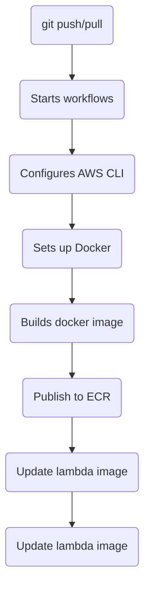

# dockerizedScraperTest
This script is designed to go through draft kings and get all of the betting odds information.

Currently it only goes through the MLB games and it gets the spread, over, under, and money lines. The plan is for it to then tie into mongodb.

## Technologies Used
- Python 3.9
- Selenium
- BeautifulSoup

## Deployment Script

Here is small diagram of the deployment as it stands. I still need to add tests into this platform.

